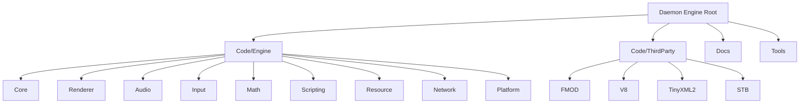

# Daemon Engine - Game Engine Architecture

**Changelog**
- 2025-09-15 10:46:17: Updated AI context initialization with current timestamp and module structure verification
- 2025-09-06 21:17:11: Comprehensive AI context documentation update with complete module coverage
- 2025-09-06 19:54:50: Initial AI context initialization and documentation

## Project Vision

Daemon Engine is a modular, performance-oriented game engine built from the ground up with modern C++ practices. Designed for both educational purposes and production-ready game development, it provides a comprehensive suite of systems including advanced rendering, robust audio management, flexible input handling, cross-platform networking capabilities, and JavaScript scripting integration via V8.

## Architecture Overview

The engine follows a modular, subsystem-based architecture where each major system operates independently but communicates through a global event system. The architecture emphasizes:

- **Modular Design**: Well-defined system boundaries for maintainability
- **Performance-First**: Optimized rendering pipeline with batch processing
- **Data-Oriented Design**: Cache-friendly data structures and processing patterns
- **Event-Driven Communication**: Loose coupling between systems

### Technical Stack
- **Language**: C++20 with modern practices
- **Graphics API**: DirectX 11
- **Audio**: FMOD integration with 3D spatial audio
- **Scripting**: V8 JavaScript engine integration
- **Platform**: Windows (x64) with planned cross-platform support
- **Build System**: Visual Studio projects with MSBuild

## Module Structure Diagram



## Module Index

| Module | Path | Responsibility | Entry Points | Status |
|--------|------|----------------|--------------|---------|
| **Core** | `Code/Engine/Core/` | Foundation systems, events, utilities, logging | `EngineCommon.hpp`, `EventSystem.hpp` | Active |
| **Renderer** | `Code/Engine/Renderer/` | DirectX 11 rendering pipeline, cameras, shaders | `Renderer.hpp`, `Camera.hpp` | Active |
| **Audio** | `Code/Engine/Audio/` | FMOD-based 3D audio system | `AudioSystem.hpp` | Active |
| **Input** | `Code/Engine/Input/` | Keyboard, mouse, controller input handling | `InputSystem.hpp` | Active |
| **Math** | `Code/Engine/Math/` | Mathematical primitives and operations | `MathUtils.hpp`, `Vec3.hpp`, `Mat44.hpp` | Active |
| **Scripting** | `Code/Engine/Scripting/` | V8 JavaScript integration | `V8Subsystem.hpp` | Active |
| **Resource** | `Code/Engine/Resource/` | Asset loading, caching, resource management | `ResourceSubsystem.hpp` | Active |
| **Network** | `Code/Engine/Network/` | TCP/UDP networking foundation | `NetworkSubsystem.hpp` | Active |
| **Platform** | `Code/Engine/Platform/` | OS abstraction layer | `Window.hpp` | Active |

## Running and Development

### Prerequisites
- Visual Studio 2019 or later with C++20 support
- Windows 10 SDK (10.0.18362.0 or later)
- DirectX 11 compatible graphics hardware
- Git for version control

### Build Instructions
```bash
# Clone the repository
git clone https://github.com/dadavidtseng/DaemonEngine.git
cd DaemonEngine

# Open Visual Studio solution
start Engine.sln

# Build configuration
# - Set platform to x64
# - Choose Debug or Release configuration
# - Build solution (Ctrl+Shift+B)
```

### Basic Engine Usage
```cpp
#include "Engine/Core/EngineCommon.hpp"
#include "Engine/Renderer/Renderer.hpp"
#include "Engine/Audio/AudioSystem.hpp"

// Initialize core systems
g_theRenderer = new Renderer();
g_theAudio = new AudioSystem();
g_eventSystem = new EventSystem();

// Game loop
while (isRunning) {
    g_theRenderer->BeginFrame();
    // Your game logic here
    g_theRenderer->EndFrame();
}
```

## Testing Strategy

The project currently lacks a comprehensive testing framework but follows these practices:
- Manual testing through developer console
- Performance profiling via built-in debug systems
- Visual debugging through DebugRenderSystem
- Memory tracking and leak detection

**Recommended additions**:
- Unit test framework integration (Google Test)
- Automated regression testing
- Performance benchmarking suite

## Coding Standards

### C++ Guidelines
- Follow C++20 standards and modern practices
- Use PascalCase for classes and enums: `AudioSystem`, `eBlendMode`
- Use camelCase for functions and variables: `BeginFrame()`, `m_deviceContext`
- Use snake_case for file names: `audio_system.cpp` (though project uses PascalCase currently)
- Prefix member variables with `m_`: `m_config`, `m_isInitialized`
- Use explicit constructors where appropriate
- Prefer smart pointers over raw pointers for ownership
- Document all public APIs with comprehensive comments

### Architecture Patterns
- **RAII**: Resource management through constructors/destructors
- **PIMPL**: Used in V8Subsystem for implementation hiding
- **Factory Pattern**: Resource creation and management
- **Observer Pattern**: Event system for loose coupling
- **Singleton Pattern**: Global system access (used sparingly)

### Performance Considerations
- Memory pool allocators for frequent allocations
- Batch processing for rendering operations
- Cache-friendly data layout where possible
- Minimal dynamic allocations in performance-critical paths

## AI Usage Guidelines

When working with this codebase using AI assistance:

1. **System Understanding**: Always review module interfaces (`*.hpp` files) before making changes
2. **Performance Impact**: Consider rendering and audio performance implications
3. **Memory Management**: Follow RAII patterns and avoid memory leaks
4. **Threading Safety**: Be aware of multi-threaded contexts (ResourceSubsystem, AudioSystem)
5. **Dependency Management**: Understand third-party integration points (V8, FMOD, DirectX)
6. **Testing Approach**: Use developer console and debug visualization for verification
7. **Documentation**: Update module-level documentation for significant changes

### Common Integration Points
- Global system pointers in `EngineCommon.hpp`
- Event system for inter-module communication
- Resource system for asset management
- Scripting interface for gameplay programming